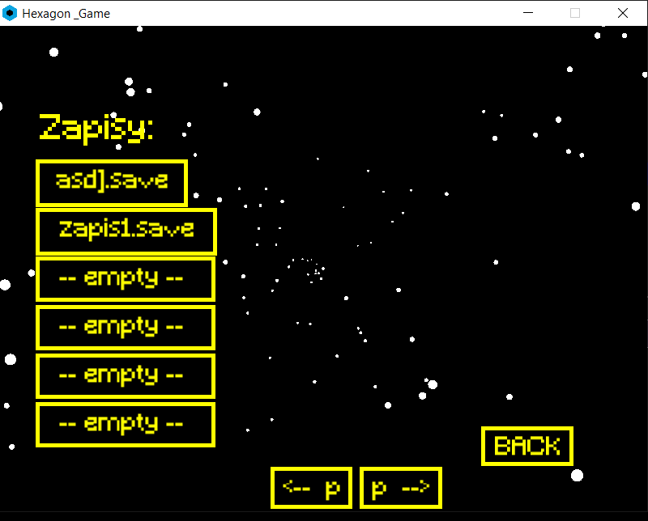
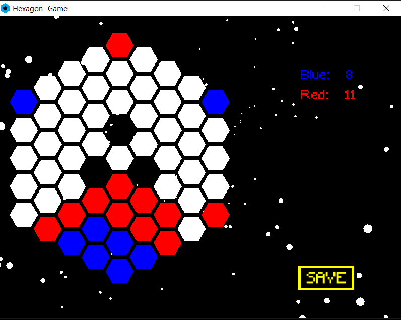

# GraHexxagon
A project done as part of a class for college. The Hexxagon game is based on the instie game
[Hexxagon.com](https://hexxagon.com/)
---
## Rules
The board is made of hexagons with three empty fields in the center.
Players take turns to move, they can move by one field (in which case they copy their figure onto it)
or by two fields (in which case they move the figure to that field). Each move
figure causes a change in the opponent's figures, adjacent to the field to which the figure moves,
to the figures of the player who moved the figure. The winner is the person who, after filling all the fields (or no movement)
has the most figures.

---

## Preview

---
## Features
- recording
- loading
- game functions
- animated background with praticles
- animated buttons
- music manager
- sound effects
- top players ranking
- AI with depth 2
- PvP game

---
## Technologies
- Doxygen 
- SFML
- C++
- CMake